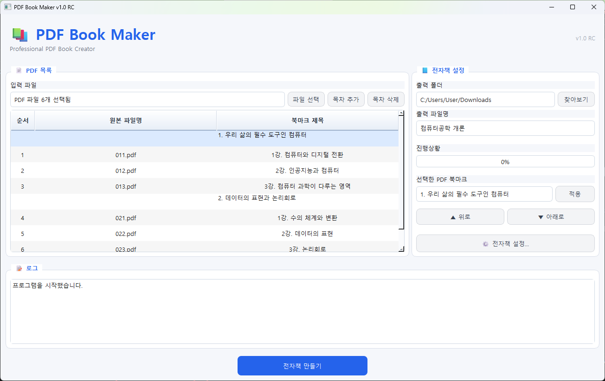
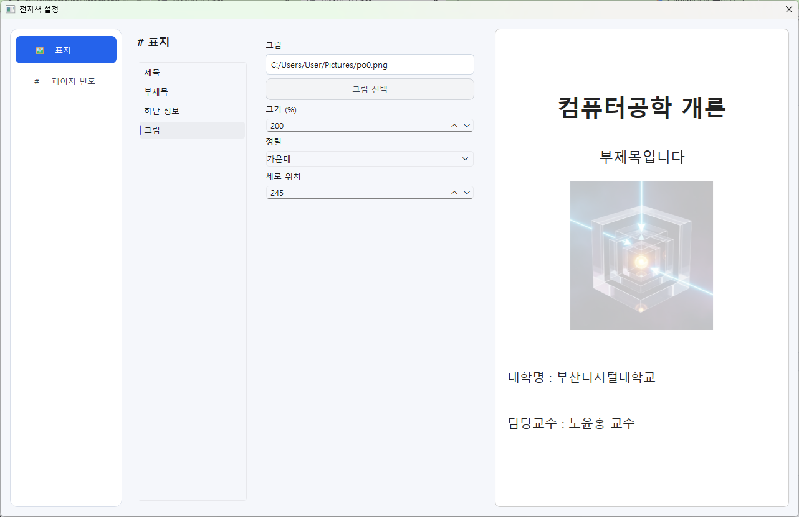
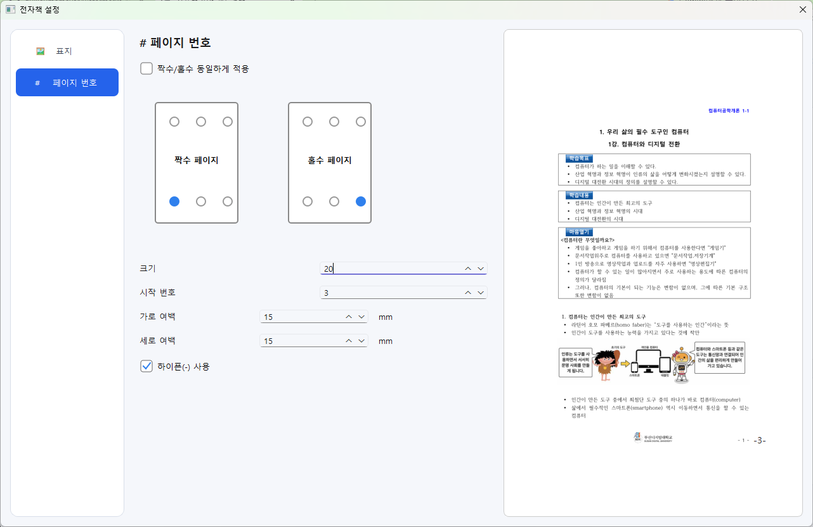
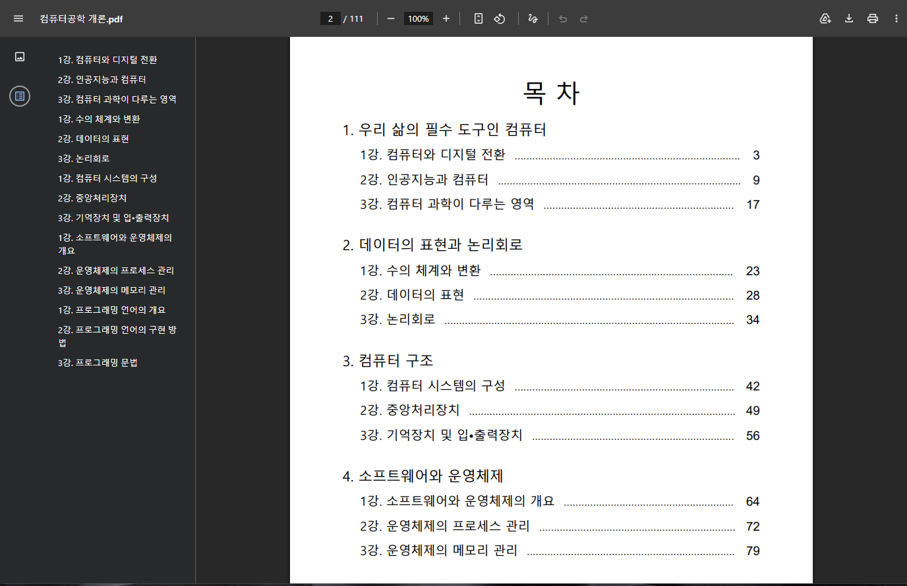

# PDF Book Maker

여러 PDF를 표지, 목차, 북마크와 연속 페이지 번호가 포함된 하나의 전자책으로 만드는 Windows 프로그램입니다.

현재 버전은 `v1.0 RC`입니다.

## 주요 기능

- 여러 PDF를 원하는 순서로 병합
- 전자책 표지 자동 생성
- 항목 수에 따라 여러 목차 페이지 자동 생성
- PDF별 제목 편집
- PDF 북마크 생성
- 본문 기준 연속 페이지 번호
- 병합 진행률과 단계별 로그 표시
- 기존 결과 파일을 보호하는 안전한 저장

## 프로그램 화면

### 메인 화면

여러 PDF와 목차를 원하는 순서로 구성하고 전자책 생성 정보를 설정할 수 있습니다.



### 표지 설정

제목, 부제목, 하단 정보와 이미지를 설정하고 결과를 미리 확인할 수 있습니다.



### 페이지 번호 설정

짝수·홀수 페이지의 번호 위치와 크기, 시작 번호, 여백 및 표시 형식을 설정할 수 있습니다.



### 생성 결과

자동 생성된 목차와 PDF 북마크가 포함된 최종 전자책입니다.



## 실행 환경

## 실행 환경

- Windows 10 또는 Windows 11
- Python 3.10 이상

## 개발 환경 실행

```powershell
python -m venv .venv
.\.venv\Scripts\Activate.ps1
python -m pip install -r requirements.txt
python main.py
```

## 사용 방법

## 사용 방법

1. `파일 선택`에서 병합할 PDF 파일을 선택합니다.
2. `▲ 위로`, `▼ 아래로` 버튼으로 PDF의 병합 순서를 조정합니다.
3. 필요한 경우 각 PDF의 전자책 제목을 수정하고 `적용`을 누릅니다.
4. 출력 폴더와 최종 PDF 파일명을 지정합니다.
5. `전자책 설정`을 눌러 표지와 페이지 번호를 설정합니다.
6. 표지 설정에서 제목, 부제목, 하단 정보와 이미지를 설정하고 미리보기에서 결과를 확인합니다.
7. 페이지 번호 설정에서 위치, 크기, 시작 번호, 여백과 표시 형식을 설정합니다.
8. 설정을 완료한 뒤 메인 화면에서 `전자책 만들기`를 누릅니다.
9. 병합이 완료되면 지정한 출력 폴더에서 완성된 PDF를 확인합니다.

목차와 북마크에는 메인 화면에 표시된 PDF의 순서와 전자책 제목이 사용됩니다.

표지와 페이지 번호 설정은 자동으로 저장되며 프로그램을 다시 실행하면 마지막으로 사용한 설정이 복원됩니다.

목차와 북마크에는 화면에 표시된 PDF 순서와 제목이 사용됩니다.

## 테스트

```powershell
python -m unittest discover -s tests -v
```

테스트는 다중 목차, 북마크, 병합 순서, 진행률, 로그와 누락 파일 오류를 확인합니다.

## Windows 실행파일 만들기

```powershell
python -m pip install -r requirements-dev.txt
pyinstaller --noconfirm --clean pdf_book_maker.spec
```

완성된 프로그램은 `dist\PDFBookMaker.exe`에 생성됩니다. 맑은 고딕 폰트 파일은 실행파일에 함께 포함됩니다.

## 프로젝트 구조

```text
PDF-Book-Maker/
│
├─ main.py
│  └─ 프로그램 시작
│
├─ ui_main.py
│  └─ 메인 화면 및 전자책 생성 제어
│
├─ file_merge.py
│  └─ 표지, 목차, 페이지 번호, 북마크 및 PDF 병합
│
├─ ui/
│  ├─ settings_dialog.py
│  │  └─ 전자책 설정 창
│  │
│  ├─ pages/
│  │  ├─ cover_page.py
│  │  │  └─ 표지 설정
│  │  └─ page_number_page.py
│  │     └─ 페이지 번호 설정
│  │
│  ├─ widgets/
│  │  ├─ cover_preview_widget.py
│  │  │  └─ 표지 미리보기
│  │  ├─ page_number_preview_widget.py
│  │  │  └─ 페이지 번호 미리보기
│  │  ├─ position_selector.py
│  │  │  └─ 페이지 번호 위치 선택
│  │  └─ check_box.py
│  │     └─ 사용자 정의 체크박스
│  │
│  └─ utils/
│     └─ page_number_helper.py
│        └─ 페이지 번호 위치 계산
│
├─ assets/
│  └─ fonts/
│     └─ malgun.ttf
│        └─ PDF 출력용 한글 글꼴
│
├─ tests/
│  └─ 자동 테스트
│
├─ requirements.txt
│  └─ 실행에 필요한 Python 패키지
│
├─ requirements-dev.txt
│  └─ 개발 및 배포용 패키지
│
├─ pdf_book_maker.spec
│  └─ PyInstaller 실행파일 빌드 설정
│
├─ README.md
│  └─ 프로젝트 소개 및 사용 방법
│
├─ CHANGELOG.md
│  └─ 버전별 변경사항
│
├─ TODO.md
│  └─ 향후 작업 목록
│
├─ BUGS.md
│  └─ 발견된 오류 및 수정 기록
│
└─ DEVLOG.md
   └─ 개발 진행 기록

## 현재 제한사항

- 암호가 설정된 PDF는 지원하지 않습니다.
- 입력 파일은 PDF 형식만 지원하며 ZIP 파일은 지원하지 않습니다.
- PDF 병합 중에는 작업이 완료될 때까지 프로그램의 응답이 일시적으로 느려질 수 있습니다.

## 릴리스 전 확인사항

- [ ] 실제 Windows 환경에서 대용량 PDF 병합 확인
- [ ] Windows 실행파일(EXE) 제작
- [ ] 깨끗한 Windows 환경에서 실행파일 실행 확인
- [ ] 사용자 매뉴얼 작성
- [ ] 프로그램 스크린샷 추가
- [ ] 프로젝트 라이선스 결정 및 `LICENSE` 파일 추가
